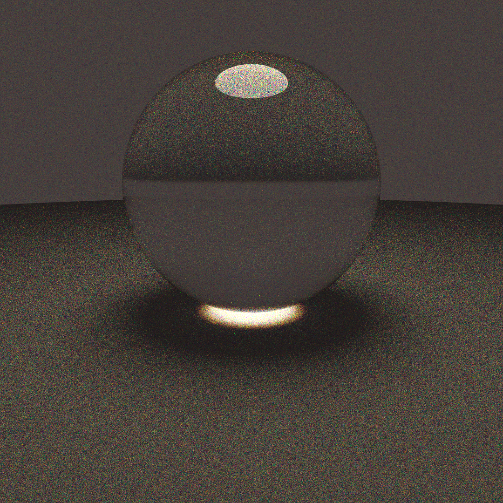

# This repo contains the code for a work in progress article series about Spectral Path Tracing

if you'd like to see a more fleshed out repository, see my main repo [here](https://github.com/gillett-hernandez/rust-pathtracer)

current render:

currently implemented features:

* [x] Spheres and sphere intersection
* [x] Spectral Power Distributions and Reflectance functions (represented as arbitrary curves)
* [x] Parsing curves from files
* [x] Mediums (on branch mediums)
* [x] BSDF sampling

To implement:

* [ ] other basic primitives (rects, to render the classic cornell box scene)
* [ ] NEE
* [ ] russian roulette
* [ ] some acceleration structure (BVH)
* [ ] basic texturing, likely using srgb upscaling
