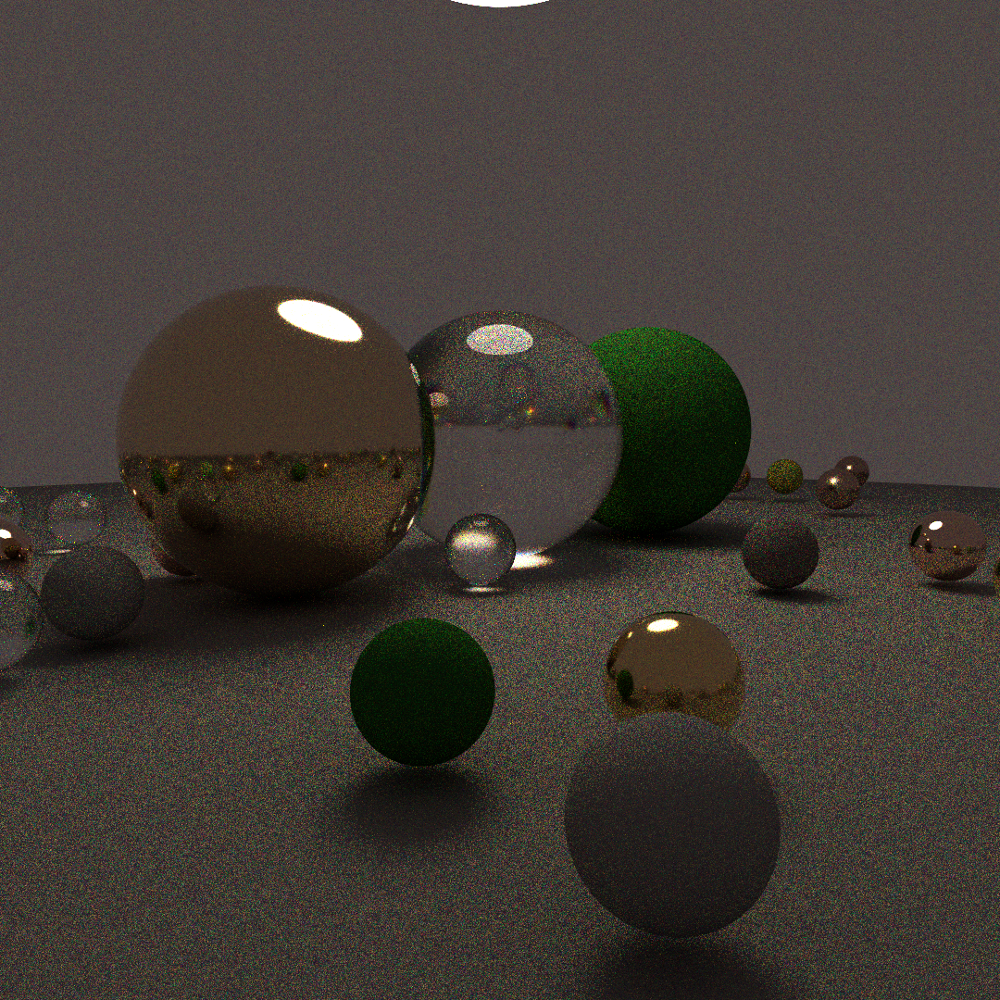

# This repo contains the code for a work in progress article series about Spectral Path Tracing

if you'd like to see a more fleshed out repository, see my main repo [here](https://github.com/gillett-hernandez/rust-pathtracer)

current render:

currently implemented features:
Spheres and sphere intersection
Spectral Power Distributions and Reflectance functions (represented as arbitrary curves)
Parsing curves from files
Mediums (on branch mediums)
BSDF sampling

To implement:
NEE
other basic primitives (rects)
basic texturing, likely using srgb upscaling
